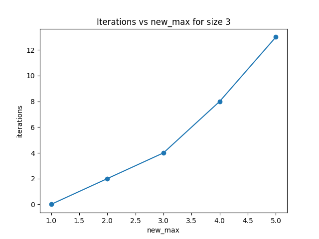
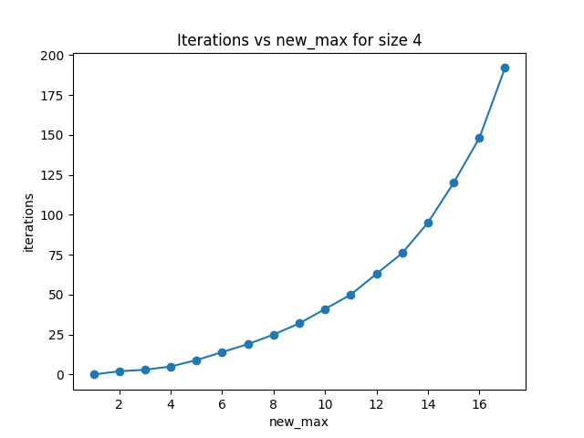
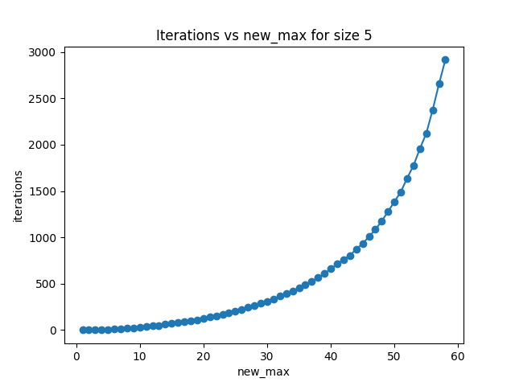
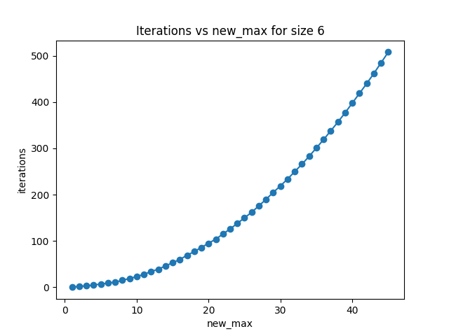
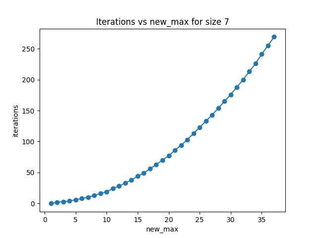
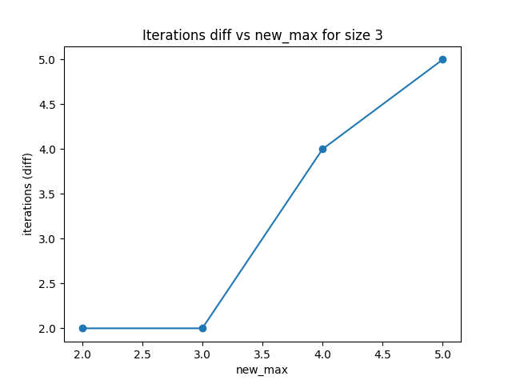
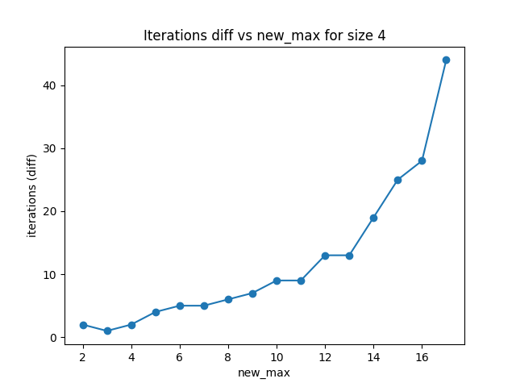
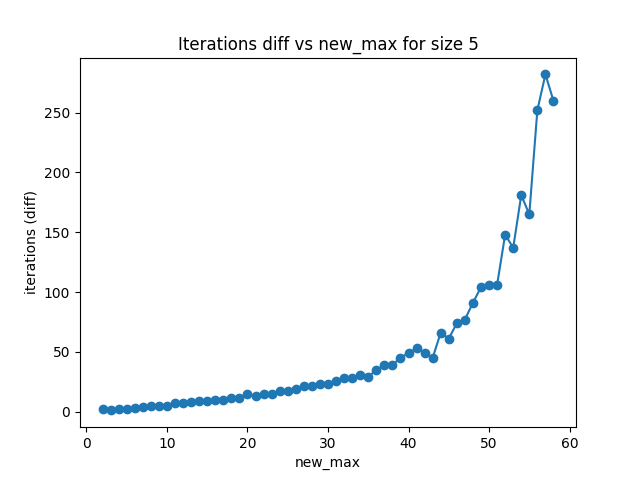
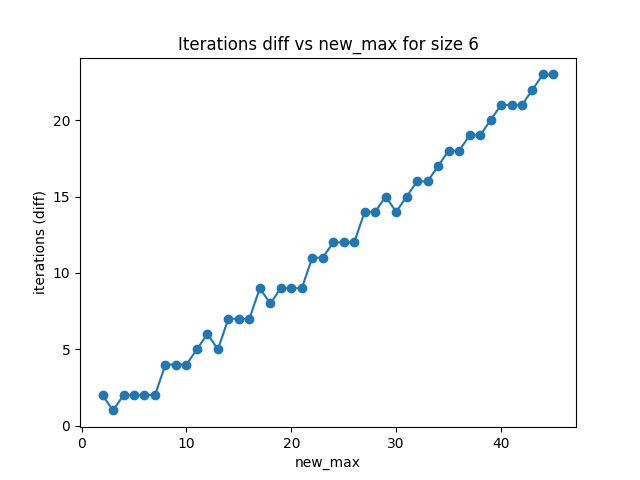
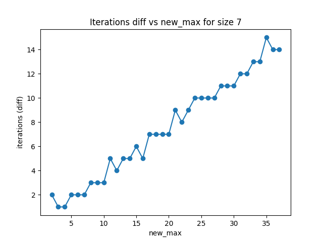

# Ekin

This is a tool to analyze the Ekin problem. It is a mathematical problem that is simple to state but hard to solve. The
problem is as follows:

You are given a vector of integers of a fixed size `n` that starts at only zeros. You may choose a subset of these
integers
and depending on the sum of this subset, you may increment or decrement the values of the subset by 1:

- If the sum is smaller than zero, you increment all the values of the subset by 1.
- If the sum is greater than zero, you decrement all the values of the subset by 1.
- If the sum is zero, both operations are allowed.

You may repeat this for a finite number of steps. (Choose new subset, calculate sum and apply an operation)

The question is: Is the resulting vector bounded for all `n`?

For small `n`, like `n=1` and `n=2` it is quite easy to see that they are bounded by `1` and `2` respectively. But for
larger `n` it is not so easy to see. This tool is designed to analyze this problem for larger `n`.

We were able to solve the problem for `n=3`, `n=4` and `n=5`. For `n=6` and `n=7` we ran the tool for a while until it
ran out of memory (~22gb).

These are the bounds we found:

- `n=1`: 1
- `n=2`: 2
- `n=3`: 5
- `n=4`: 17
- `n=5`: 58

The algorithm uses exhaustive breadth first search, which means that it will find all combinations and always
find the shortest path to each vector state. To analyze some patterns in the problem, we looked at the bounds reached
by the algorithm at various `n` and how many iterations (operations) it took to reach that bound. We found that these
plots look rather smooth, so there may be a pattern to be found. You can find the data [here](data/).

Plots are done with python, while the algorithm is written in Go.

Looking at the differences between each number of iterations, we get a numeric derivative of these curves:

